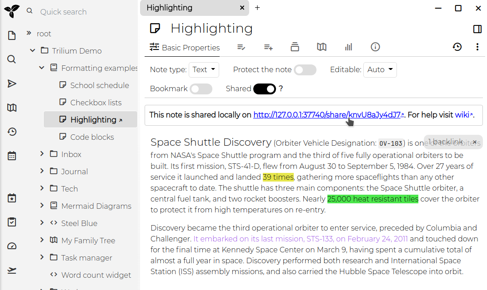
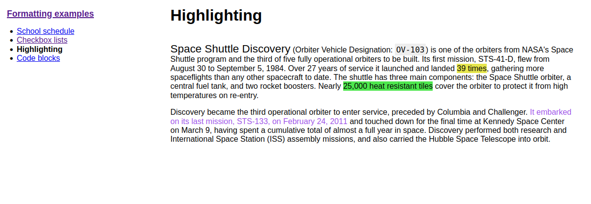
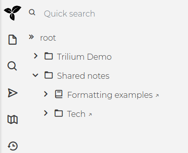

Since v0.49 Trilium offers a feature to share selected notes as publicly accessible read only documents.

Basic prerequisite for this feature is to have a [[server installation]] - this is where the notes will be hosted from.

## Share note

Click on the "shared" switch, URL appears on which you can click.

And this is the opened link:

The URL refers to the localhost (127.0.0.1) because there's no configured sync server.

## Share a note subtree

Sharing a note actually shares a whole subtree of notes, the note shown above just didn't have any children.

If I share the whole "Formatting" subtree then the page looks like this:

You can see a basic navigation on the right. With this you can create small websites.

## Advanced options

### Styling the shared notes

The default shared page is pretty rudimentary. In case you want to style it more nicely you can:

* add a `~shareCss` relation to a CSS code note which will be linked in the shared page
  * in case you want this to apply to the whole subtree, don't forget to make the label inheritable 
  * the linked CSS code note needs to be also in the shared subtree. If you want to hide it from left tree navigation, add `#shareHiddenFromTree` label to the CSS code note.
* if you make extensive styling changes then it's recommended to use `#shareOmitDefaultCss` on the shared subtree so that you don't need to override default stylesheet (this will also avoid problems in the future when the default CSS changes).

### Creating human-readable URL aliases

Shared notes are accessible using URLs like `http://domain/share/knvU8aJy4dJ7`, where the last part is note's ID.

You can add `#shareAlias` to individual notes to make the URLs nicer, e.g. `#shareAlias=highlighting` will make the URL look like `http://domain/share/formatting`.

Note that you are responsible for keeping the aliases unique.

### Seeing all shared notes

All shared notes are grouped under automatically managed "Share Notes" note. Besides seeing what's shared, you can also effectively share/unshare notes by cloning/moving them from/to this note.

## Limitations

Shared notes functionality is compared to standard functionality very limited.

The not exhaustive list of **what is missing** is:

* math support
* mermaid support
* relation map support
* scripting
* book notes show only children note list
* code notes have no highlighting
* note tree is static

Some of these limitations might be removed/mitigated in the future.
