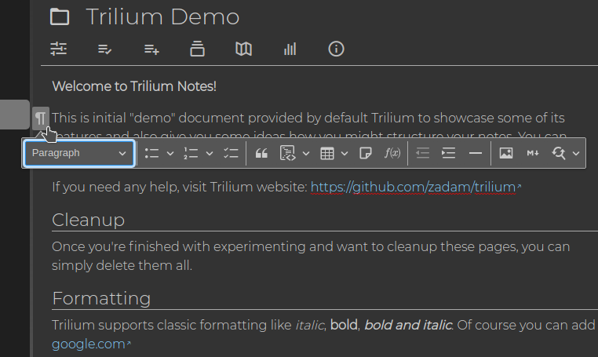

Trilium uses awesome [CKEditor 5](https://ckeditor.com/ckeditor-5/) as its editing component.

## Formatting

Trilium text note interface doesn't show any toolbars or formatting options by default, these needs to be brought up by:

1) selecting text will bring up inline toolbar:

2) clicking on the block toolbar:

## Read only vs. editing mode

Text notes are normally opened in edit mode, however there are two cases when they are open in read only mode:

* they are long and thus would take time to load so by default we open them as read only which is much quicker
* or the note has `readOnly` [[label|attributes]]

In both cases it is possible to switch to editable mode again.
 
## Markdown & Autoformat

CKEditor supports markdown-like editing experience. It recognizes syntax and automatically converts it to rich text. See it in action:

[[gifs/autoformat.gif]]
Complete documentation for this feature is available in [CKEditor documentation](https://ckeditor.com/docs/ckeditor5/latest/features/autoformat.html).

If the autoformat is not desirable for what you just wrote, you can press `CTRL-Z` which will un-autoformat the text to its original form.

Note that the use of `#` for Heading1 style is not supported because the editor assumes that is used for the title, start with `##` for Heading2. Explanation [here](https://ckeditor.com/docs/ckeditor5/latest/features/headings.html#heading-levels).

## Math support

Trilium provides Math support with the help of KaTex:

[[gifs/math.gif]]

## Cut selection to sub-note
One of the common situations in Trilium is when you're editing a document, and it gets somewhat large, so you start splitting it up into sub-notes - the process is essentially like this:

* select the desired piece of text and cut it into clipboard
* create new sub-note & give it name
* paste the content from clipboard into sub-note

Trilium provides a way to automate this:

[[gifs/cut-to-subnote.gif]]

You can notice how heading "Formatting" is automatically detected and new sub-note is named "Formatting".

It is also possible to assign a keyboard shortcut for this action.

## Include note

Text notes can "include" another note as a read only widget. This can be useful for e.g. including a dynamically generated chart (from scripts & "render HTML" note) or other more advanced use cases.

This functionality is available in the block toolbar icon.

